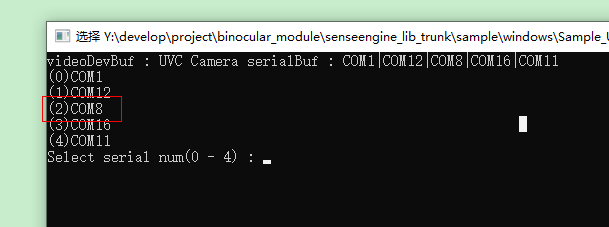
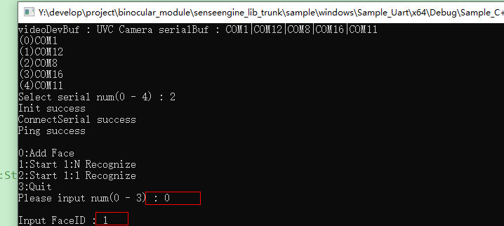
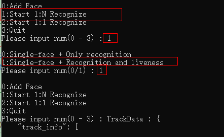

## 典型应用

* 上位机串口波特率采用115200
* 入库+识别结果推送接口调用流程:
  * 枚举串口设备
  * 初始化并连接串口
  * Ping确认通信通道正常
  * 关闭视频流中叠加识别信息优化性能
  * 人脸入库
  * 打开串口上报
  * 开启1:N识别
  * 注册识别结果以及跟踪结果上报回调

具体代码流程可参考工程sample/windows/Sample_Uart的demo

## 使用方法

* 连接产品预留uart rx tx gnd至上位机的tx rx gnd,同时给设备供电

  

* 重编sample/windows/Sample_Uart的工程或者直接运行sample/windows/Sample_Uart/x64/Debug/Sample_C++.exe

* 根据提示先选择上位机物理串口

  

* 连接成功后完成入库，在Input FaceID输入之前需要人脸正对镜头

* 勾选1:N活体识别后人脸对准摄像头即可看到输出的识别结果

  

## 特殊说明

* 视频类接口不支持(其余接口使用方法参考**SenseEngine AI视觉模组Win&Linux开发接口使用文档**)
  * SetUvcSwitch
  * SwitchCamRgbIr
  * MirrorCamRgbIr
  * SetStreamFormat
  * GetFrameRate
  * SetFrameRate
  * GetFrame
  * GetResolution
* 图片回传耗时较久（受限于波特率），不建议使用
* 升级功能会比较慢（受限于波特率）

